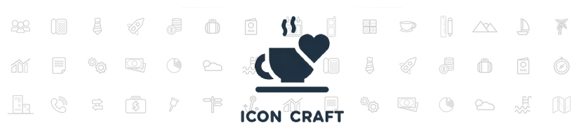
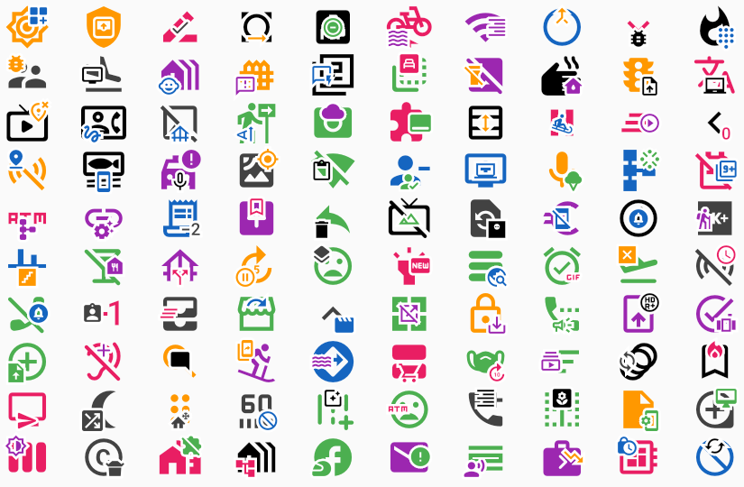

# IconCraft



IconCraft is a Flutter plugin designed to extend the functionality of the standard `Icon` widget. It allows developers to create richer iconography with the ability to combine two icons into a single widget with alignment and scaling options.

> 🚧 Please note: This project is currently in its initial development phase. As such, the API may undergo significant modifications. 

## Features

- **Borders**: Add customizable borders around your icons with configurable colors, widths, and styles.
- **Secondary Icon**: Add an auxiliary icon on top of the base icon, with control over its alignment and relative size, perfect for building creative icon designs.
- **Flexible Alignment**: Precisely position a secondary icon relative to the primary icon, suitable for various UI design needs.

## Installation

To start using IconCraft, add it to your Flutter project by including it in your `pubspec.yaml` file:

```yaml
dependencies:
  icon_craft: ^0.1.0
```

Run `flutter pub get` to install the new dependency.

## Usage
Here's how you can use the IconCraft widget in your Flutter application:

#### Base Icon

```dart
IconCraft(
  primaryIcon: Icon(Icons.email),
  decoration: IconDecoration(
    border: IconBorder(color: Colors.black, width: 2.0),
  ),
)
```

#### Adding a Secondary Icon

To add a secondary icon with `top right` alignment:

```dart
IconCraft(
  primaryIcon: Icon(Icons.message),
  secondaryIcon: Icon(Icons.check),
  alignment: Alignment.topRight,
  decoration: IconDecoration(
    border: IconBorder(color: Colors.blue, width: 1.0),
  ),
)
```

## TODO

▶️ Add many more examples

▶️ Add screenshots

▶️ Add 3rd party icon packages compatibility list

## Screenshots
Here are some screenshots showing what you can achieve with IconCraft:



## Icon packages compatibility:

✅ [Icons Plus](https://pub.dev/packages/icons_plus)

## Credits

This package is inspired by Roux Guillame's work. His original code can be found in this [repository](https://pub.dev/packages/icon_decoration)

## License

Distributed under the MIT License. See LICENSE for more information.